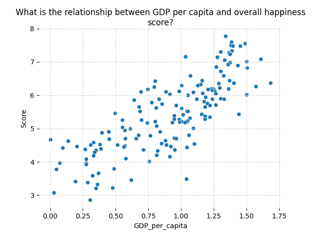
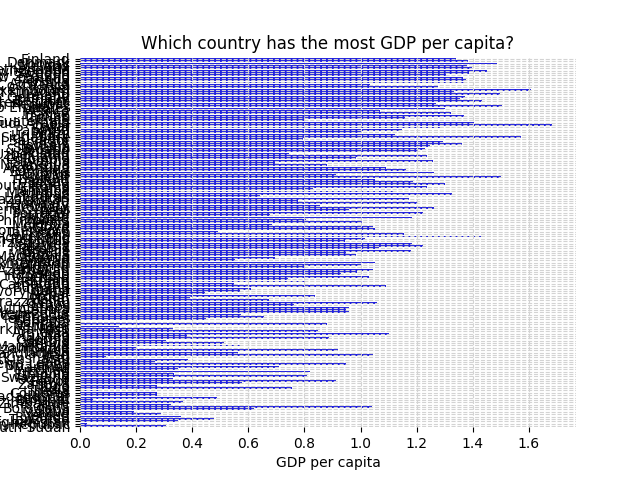

# Question-Based Graph Using LLM

## Overview

This project presents a novel application of Large Language Models (LLMs) for generating question-based graphs. It uses natural language processing to interpret user queries and visualize the data in an interactive graph format.

## Features

- **Dynamic Graph Generation:** Create graphs dynamically based on user questions.
- **LLM Integration:** Leverage Large Language Models for natural language understanding and response generation.
- **Interactive User Interface:** Easy-to-use UI for inputting questions and displaying graphs.

## Installation

To install and run the project locally, follow these steps:

1. **Clone the Repository:**

git clone question-based-graph-llm.git

2. **Navigate to the Project Directory:**

## Usage

To use the application:

1. Run the application:

2. Input a question in the provided interface.
3. The system will analyze the query and display the corresponding graph.

## Example Graphs

Here are some examples of graphs created by the system:

1. **Graph 1:**

*Description of Graph 1.*

2. **Graph 2:**

*Description of Graph 2.*

## Contributing

Contributions are welcome. Please fork the repository and submit a pull request with your changes.

## License

This project is licensed under the MIT License - see the [LICENSE](LICENSE) file for details.

